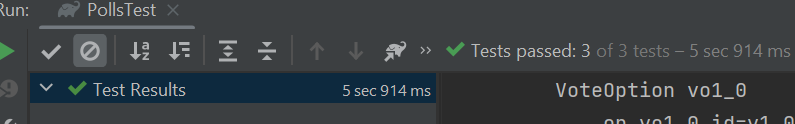

## Expass 4 JPA

#### Issues i faced with this project

I had some issues with the build files when i had one file for both spring and jpa. I solved this by making a seperate build file for jpa.

Heres a screenshot which shows that the test passes:

 

After running the PollsTest, Hibernate had created four tables: USERS, POLL, VOTE, and VOTEOPTION.

